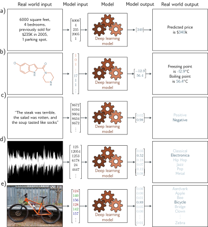
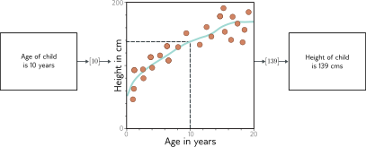
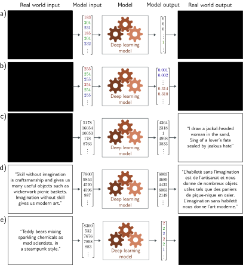
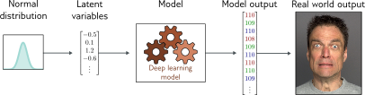
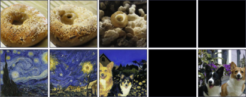
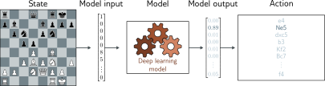

## 1.1 Supervised learning

# Chapter 1 Introduction

**Artificial intelligence**, or **AI**, is concerned with building systems that simulate intelligent behavior. It encompasses a wide range of approaches, including those based on logic, search, and probabilistic reasoning. **Machine learning** is a subset of AI that learns to make decisions by fitting mathematical models to observed data. This area has seen explosive growth and is now (incorrectly) almost synonymous with the term AI.

A **deep neural network** is a type of machine learning model, and when it is fitted to data, this is referred to as **deep learning**. At the time of writing, deep networks are the most powerful and practical machine learning models and are often encountered in day-to-day life.

As the title suggests, this book aims to help a reader new to this field understand the principles behind deep learning. **The book is neither terribly theoretical (there are no proofs) nor extremely practical (there is almost no code).** The goal is to explain the underlying ***ideas***; after consuming this volume, the reader will be able to apply deep learning to novel situations where there is no existing recipe for success.

Machine learning methods can coarsely be divided into three areas: **supervised**, **unsupervised**, and **reinforcement** learning. At the time of writing, the cutting-edge methods in all three areas rely on deep learning. Whether we like it or not, deep learning is poised to change our world, and this change will not all be positive.

## 1.1 Supervised learning

Supervised learning models define a mapping from input data to an output prediction. In the following sections, we discuss the inputs, the outputs, the model itself, and what is meant by “training” a model.

### 1.1.1 Regression and classification problems

<figure>
  

  
<figcaption>Figure 1.2</figcaption>

</figure>

Figure 1.2 depicts several regression and classification problems. In each case, there is a meaningful real-world input (a sentence, a sound file, an image, etc.), and this is encoded as a vector of numbers. This vector forms the model input. The model maps the input to an output vector which is then “translated” back to a meaningful real-world prediction. For now, we focus on the inputs and outputs and treat the model as a black box that ingests a vector of numbers and returns another vector of numbers.

The model in figure 1.2a predicts the price of a house based on input characteristics such as the square footage and the number of bedrooms. This is a **regression** problem because the model returns a continuous number (rather than a category assignment). In contrast, the model in figure 1.2b takes the chemical structure of a molecule as an input and predicts both the freezing and boiling points. This is a **multivariate regression** problem since it predicts more than one number.

The model in figure 1.2c receives a text string containing a restaurant review as input and predicts whether the review is positive or negative. This is a **binary classification** problem because the model attempts to assign the input to one of two categories. The output vector contains the probabilities that the input belongs to each category. Figures 1.2d and 1.2e depict **multiclass classification** problems. Here, the model assigns the input to one of $N > 2$ categories. In each case, the model returns a vector of size $N$ that contains the probabilities of the N categories.

### 1.1.2 Inputs

The input data in figure 1.2 varies widely. In the house pricing example, the input is a fixed-length vector containing values that characterize the property. This is an example of **tabular data** because it has no internal structure; if we change the order of the inputs and build a new model, then we expect the model prediction to remain the same.

Conversely, the input in the restaurant review example is **a body of text**. This may be of variable length depending on the number of words in the review, and here input order is important; my wife ate the chicken is not the same as the chicken ate my wife. The text must be encoded into numerical form before passing it to the model. Here, we use a fixed vocabulary of size 10,000 and simply concatenate the word indices.

For the music classification example, the input vector might be of fixed size (perhaps a 10-second clip) but is very **high-dimensional**. Digital audio is usually sampled at 44.1 kHz and represented by 16-bit integers, so a ten-second clip consists of 441, 000 integers. Clearly, supervised learning models will have to be able to process sizeable inputs. The input in the image classification example (which consists of the concatenated RGB values at every pixel) is also enormous. Moreover, its structure is **naturally two-dimensional**; two pixels above and below one another are closely related, even if they are not adjacent in the input vector.

Finally, consider the input for the model that predicts the freezing and boiling points of the molecule. A molecule may contain varying numbers of atoms that can be connected in different ways. In this case, the model must ingest both the **geometric structure** of the molecule and the constituent atoms to the model.

### 1.1.3 Machine learning models

<figure>
  

  
<figcaption>Figure 1.3</figcaption>

</figure>

Until now, we have treated the machine learning model as a black box that takes an input vector and returns an output vector. But what exactly is in this black box? Consider a model to predict the height of a child from their age (figure 1.3). The machine learning model is a mathematical equation that describes how the average height varies as a function of age (cyan curve in figure 1.3). When we run the age through this equation, it returns the height. 

More precisely, the model represents **a family of equations mapping the input to the output** (i.e., a family of different cyan curves). The particular equation (curve) is chosen using **training** data (examples of input/output pairs). In figure 1.3, these pairs are represented by the orange points, and we can see that the model (cyan line) describes these data reasonably. When we talk about **training** or **fitting** a model, we mean that we search through the family of possible equations (possible cyan curves) relating input to output to find the one that describes the training data most accurately.

It follows that the models in figure 1.2 require labeled input/output pairs for training. For example, the music classification model would require a large number of audio clips where a human expert had identified the genre of each. These input/output pairs take the role of a teacher or supervisor for the training process, and this gives rise to the term **supervised learning**.

Teacher Forcing: [What is Teacher Forcing for Recurrent Neural Networks? - MachineLearningMastery.com](https://machinelearningmastery.com/teacher-forcing-for-recurrent-neural-networks/)

### 1.1.4 Deep neural networks

This book concerns **deep neural network**s, which are a particularly useful type of machine learning model. They are equations that can represent an extremely broad family of relationships between input and output, and where it is particularly easy to search through this family to find the relationship that describes the training data.

Deep neural networks can process inputs that are very large, of variable length, and contain various kinds of internal structures. They can output single real numbers (**regression**), multiple numbers (**multivariate regression**), or probabilities over two or more classes (**binary and multiclass classification**, respectively). As we shall see in the next section, their outputs may also be very large, of variable length, and contain internal structure. It is probably hard to imagine equations with these properties, and the reader should endeavor to suspend disbelief for now.

### 1.1.5 Structured outputs

<figure>
  

  
<figcaption>Figure 1.4</figcaption>

</figure>

Figure 1.4a depicts a multivariate binary classification model for semantic segmentation. Here, every pixel of an input image is assigned a binary label that indicates whether it belongs to a cow or the background. Figure 1.4b shows a multivariate regression model where the input is an image of a street scene and the output is the depth at each pixel. In both cases, the output is high-dimensional and structured. However, this structure is closely tied to the input, and this can be exploited; if a pixel is labeled as “cow,” then a neighbor with a similar RGB value probably has the same label.

Figures 1.4c–e depict three models where the output has a complex structure that is not so closely tied to the input. Figure 1.4c shows a model where the input is an audio file and the output is the transcribed words from that file. Figure 1.4d is a translation model in which the input is a body of text in English, and the output contains the French translation. Figure 1.4e depicts a very challenging task in which the input is descriptive text, and the model must produce an image that matches this description.

In principle, the latter three tasks can be tackled in the standard supervised learning framework, but they are more difficult for two reasons. First, the output may genuinely be ambiguous; there are multiple valid translations from an English sentence to a French one and multiple images that are compatible with any caption. Second, the output contains considerable structure; not all strings of words make valid English and French sentences, and not all collections of RGB values make plausible images. In addition to learning the mapping, we also have to respect the “grammar” of the output. 

Fortunately, this “grammar” can be learned without the need for output labels. For example, we can learn how to form valid English sentences by learning the statistics of a large corpus of text data. This provides a connection with the next section of the book, which considers **unsupervised learning models**.

## 1.2 Unsupervised learning

Constructing a model from input data without corresponding output labels is termed **unsupervised learning**; the absence of output labels means there can be no “supervision”. Rather than learning a mapping from input to output, the goal is to describe or understand the structure of the data. As was the case for supervised learning, the data may have very different characteristics; it may be discrete or continuous, low-dimensional or high-dimensional, and of constant or variable length.

### 1.2.1 Generative models

This book focuses on **generative unsupervised models**, which learn to synthesize new data examples that are statistically indistinguishable from the training data. Some generative models explicitly describe the probability distribution over the input data and here new examples are generated by sampling from this distribution. Others merely learn a mechanism to generate new examples without explicitly describing their distribution.

State-of-the-art generative models can synthesize examples that are extremely plausible but distinct from the training examples. They have been particularly successful at generating images and text. They can also synthesize data under the constraint that some outputs are predetermined (termed **conditional generation**). Examples include image inpainting and text completion. Indeed, modern generative models for text are so powerful that they can appear intelligent. Given a body of text followed by a question, the model can often “fill in” the missing answer by generating the most likely completion of the document. However, in reality, the model only knows about the statistics of language and does not understand the significance of its answers.

### 1.2.2 Latent variables

Some (but not all) generative models exploit the observation that data can be lower dimensional than the raw number of observed variables suggests. For example, the number of valid and meaningful English sentences is considerably smaller than the number of strings created by drawing words at random. Similarly, real-world images are a tiny subset of the images that can be created by drawing random RGB values for every pixel. This is because images are generated by physical processes.

This leads to the idea that we can describe each data example using a smaller number of underlying **latent variables**. Here, the role of deep learning is to describe the mapping between these latent variables and the data. The latent variables typically have a simple probability distribution by design. By sampling from this distribution and passing the result through the deep learning model, we can create new samples (figure 1.10).

<figure>
  

  <figcaption><b>Figure 1.10</b> Latent variables. Many generative models use a deep learning model to describe the relationship between a low-dimensional “latent” variable and the observed high-dimensional data. The latent variables have a simple probability distribution by design. Hence, new examples can be generated by sampling from the simple distribution over the latent variables and then using the deep learning model to map the sample to the observed data space.</figcaption>
</figure>

These models lead to new methods for manipulating real data. For example, consider finding the latent variables that underpin two real examples. We can interpolate between these examples by interpolating between their latent representations and mapping the intermediate positions back into the data space (figure 1.11).

<figure>
  

  <figcaption><b>Figure 1.11</b> Image interpolation. In each row the left and right images are real and the three images in between represent a sequence of interpolations created by a generative model. The generative models that underpin these interpolations have learned that all images can be created by a set of underlying latent variables. By finding these variables for the two real images, interpolating their values, and then using these intermediate variables to create new images, we can generate intermediate results that are both visually plausible and mix the characteristics of the two original images.</figcaption>
</figure>

### 1.2.3 Connecting supervised and unsupervised learning

Generative models with latent variables can also benefit supervised learning models where the outputs have structure (figure 1.4). For example, consider learning to predict the images corresponding to a caption. Rather than directly map the text input to an image, we can learn a relation between latent variables that explain the text and the latent variables that explain the image. This has three advantages.

First, we may need fewer text/image pairs to learn this mapping now that the inputs and outputs are lower dimensional. Second, we are more likely to generate a plausible-looking image; any sensible values of the latent variables should produce something that looks like a plausible example. Third, if we introduce randomness to either the mapping between the two sets of latent variables or the mapping from the latent variables to the image, then we can generate multiple images that are all described well by the caption (figure 1.12).

<figure>
  

  <figcaption><b>Figure 1.12</b> Multiple images generated from the caption “A teddy bear on a skateboard in Times Square.”</figcaption>
</figure>

## 1.3 Reinforcement learning

The final area of machine learning is reinforcement learning. This paradigm introduces the idea of an agent which lives in a world and can perform certain actions at each time step. The actions change the state of the system but not necessarily in a deterministic way. Taking an action can also produce rewards, and the goal of reinforcement learning is for the agent to learn to choose actions that lead to high rewards on average.

One complication is that the reward may occur some time after the action is taken, so associating a reward with an action is not straightforward. This is known as the **temporal credit assignment problem**. As the agent learns, it must trade off exploration and exploitation of what it already knows; perhaps the agent has already learned how to receive modest rewards; **should it follow this strategy (exploit what it knows), or should it try different actions to see if it can improve (explore other opportunities)?**

### 1.3.1 Two examples

Consider teaching a humanoid robot to locomote. The robot can perform a limited number of actions at a given time (moving various joints), and these change the state of the world (its pose). We might reward the robot for reaching checkpoints in an obstacle course. To reach each checkpoint, it must perform many actions, and it’s unclear which ones contributed to the reward when it is received and which were irrelevant. This is an example of the temporal credit assignment problem.

A second example is learning to play chess. Again, the agent has a set of valid actions (chess moves) at any given time. However, these actions change the state of the system in a non-deterministic way; for any choice of action, the opposing player might respond with many different moves. Here, we might set up a reward structure based on capturing pieces or just have a single reward at the end of the game for winning. In the latter case, the temporal credit assignment problem is extreme; the system must learn which of the many moves it made were instrumental to success or failure.

The exploration-exploitation trade-off is also apparent in these two examples. The robot may have discovered that it can make progress by lying on its side and pushing with one leg. This strategy will move the robot and yields rewards, but much more slowly than the optimal solution: to balance on its legs and walk. So, it faces a choice between exploiting what it already knows (how to slide along the floor awkwardly) and exploring the space of actions (which might result in much faster locomotion). Similarly, in the chess example, the agent may learn a reasonable sequence of opening moves. Should it exploit this knowledge or explore different opening sequences?

It is perhaps not obvious how deep learning fits into the reinforcement learning framework. There are several possible approaches, but one technique is to use deep networks to build a mapping from the observed world state to an action. This is known as a **policy network**. In the robot example, the policy network would learn a mapping from its sensor measurements to joint movements. In the chess example, the network would learn a mapping from the current state of the board to the choice of move (figure 1.13).

<figure>
  

  <figcaption><b>Figure 1.13</b> Policy networks for reinforcement learning. One way to incorporate deep neural networks into reinforcement learning is to use them to define a mapping from the state (here position on chessboard) to the actions (possible moves). This mapping is known as a <b>policy</b>.”</figcaption>
</figure>

## 1.4 Ethics

- **Bias and fairness**

- **Explainability**

- **Weaponizing AI**

- **Concentrating power**

- **Existential risk**

## 1.5 Structure of book

The structure of the book follows the structure of this introduction.

- Chapters 2–9 walk through the supervised learning pipeline. We describe shallow and deep neural networks and discuss how to train them and measure and improve their performance.

- Chapters 10–13 describe common architectural variations of deep neural networks, including convolutional networks, residual connections, and transformers. These architectures are used across supervised, unsupervised, and reinforcement learning.

- Chapters 14–18 tackle unsupervised learning using deep neural networks. We devote a chapter each to four modern deep generative models: generative adversarial networks, variational autoencoders, normalizing flows, and diffusion models.

- Chapter 19 is a brief introduction to deep reinforcement learning. This is a topic that easily justifies its own book, so the treatment is necessarily superficial. However, this treatment is intended to be a good starting point for readers unfamiliar with this area.

- Despite the title of this book, some aspects of deep learning remain poorly understood. Chapter 20 poses some fundamental questions. Why are deep networks so easy to train? Why do they generalize so well? Why do they need so many parameters? Do they need to be deep? Along the way, we explore unexpected phenomena such as the structure of the loss function, double descent, grokking, and lottery tickets.

- The book concludes with chapter 21, which discusses ethics and deep learning.

## 1.7 How to read this book

Most remaining chapters in this book contain a main body of text, a notes section, and a set of problems. The main body of the text is intended to be self-contained and can be read without recourse to the other parts of the chapter. As much as possible, background mathematics is incorporated into the main body of the text. However, for larger topics that would be a distraction to the main thread of the argument, the background material is appendicized, and a reference is provided in the margin. Most notation in this book is standard. However, some conventions are less widely used, and the reader is encouraged to consult appendix A before proceeding.

The main body of text includes many novel illustrations and visualizations of deep learning models and results. I’ve worked hard to provide new explanations of existing ideas rather than merely curate the work of others. Deep learning is a new field, and sometimes phenomena are poorly understood. I try to make it clear where this is the case and when my explanations should be treated with caution.

References are included in the main body of the chapter only where results are depicted. Instead, they can be found in the notes section at the end of the chapter. I do not generally respect historical precedent in the main text; if an ancestor of a current technique is no longer useful, then I will not mention it. However, the historical development of the field is described in the notes section, and hopefully, credit is fairly assigned. The notes are organized into paragraphs and provide pointers for further reading. They should help the reader orient themselves within the sub-area and understand how it relates to other parts of machine learning. The notes are less self-contained than the main text. Depending on your level of background knowledge and interest, you may find these sections more or less useful.

Each chapter has a number of associated problems. They are referenced in the margin of the main text at the point that they should be attempted. As George Pólya noted, “Mathematics, you see, is not a spectator sport.” He was correct, and I highly recommend that you attempt the problems as you go. In some cases, they provide insights that will help you understand the main text. Problems for which the answers are provided on the associated website are indicated with an asterisk. Additionally, Python notebooks that will help you understand the ideas in this book are also available via the website, and these are also referenced in the margins of the text. Indeed, if you are feeling rusty, it might be worth working through the notebook on background mathematics right now.

Unfortunately, the pace of research in AI makes it inevitable that this book will be a constant work in progress. If there are parts you find hard to understand, notable omissions, or sections that seem extraneous, please get in touch via the associated website. Together, we can make the next edition better.
